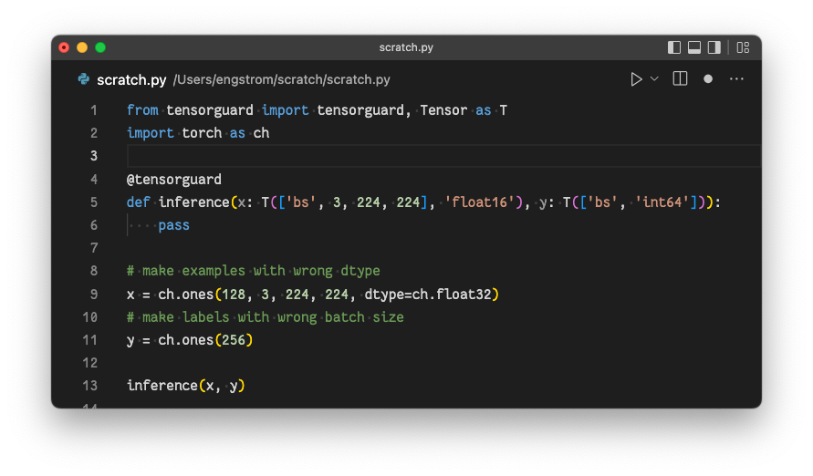

## tensorguard

Verbose tensor asserts for PyTorch and Numpy!

### Install

	git clone git@github.com:lengstrom/tensorguard.git
	pip install -e tensorguard

### Example usage

### Citation

	@misc{engstrom2022tensorguard,
		author = {Logan Engstrom},
		title = {Tensorguard},
		year = {2016},
		howpublished = {\url{https://github.com/lengstrom/tensorguard/}}
	}

### Related work

- We import typeguard (https://github.com/agronholm/typeguard) to extract the
mapping between arguments and hints/actual values 
- Torchtyping https://github.com/patrick-kidger/torchtyping has more features and for now is probably more stable? but
doesn't have very verbose outputs since it relies on tensorguard to do all the
runtime type checking

### TODOs:

- use a different color for each individual error found in the runtime type
checking