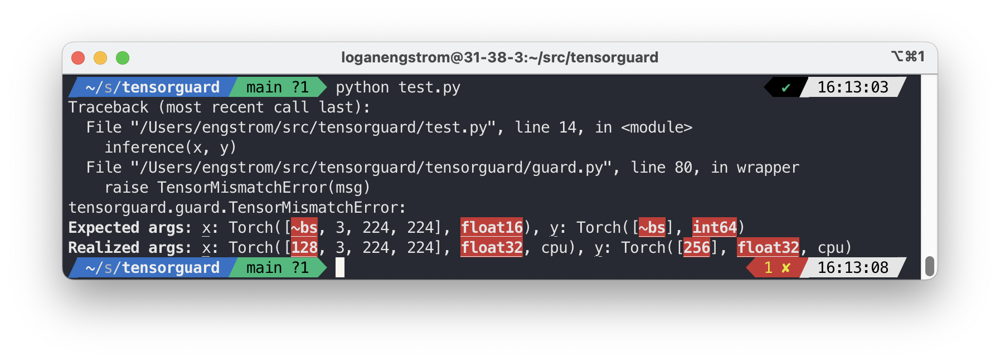

## tensorguard

Pretty runtime typechecking for PyTorch and Numpy tensors!

<p align = 'center'>

</p>

### Install

	git clone git@github.com:lengstrom/tensorguard.git
	pip install -e tensorguard

### Example usage
As a decorator:
```python
from tensorguard import tensorguard, Tensor as T
import torch as ch

@tensorguard
def inference(x: T(['bs', 3, 224, 224], 'float16'), y: T(['bs', 'int64'])):
    pass

# make examples with wrong dtype
x = ch.ones(128, 3, 224, 224, dtype=ch.float32)
# make labels with wrong batch size
y = ch.ones(256)

# checks happen at runtime with @tensorguard decorator
inference(x, y)
```

As a standalone assertion:
```python
from tensorguard import tensorcheck
x = ch.randn(4, 4).to(dtype=ch.float32)
x_expected = Tensor([4, 4])

# check one at once
tensorcheck(x, x_expected)

# or multiple...
tensorcheck([x, y], [x_expected, y_expected])
```

### Citation

	@misc{engstrom2022tensorguard,
		author = {Logan Engstrom},
		title = {Tensorguard},
		year = {2016},
		howpublished = {\url{https://github.com/lengstrom/tensorguard/}}
	}

### Related work

- We import typeguard (https://github.com/agronholm/typeguard) to extract the
mapping between arguments and hints/actual values 
- Torchtyping (https://github.com/patrick-kidger/torchtyping) has more features and for now is probably more stable. However it doesn't have very nice outputs since it relies on tensorguard to do all the
runtime type checking.


### TODOs:

- use a different color for each individual error found in the runtime type
checking
